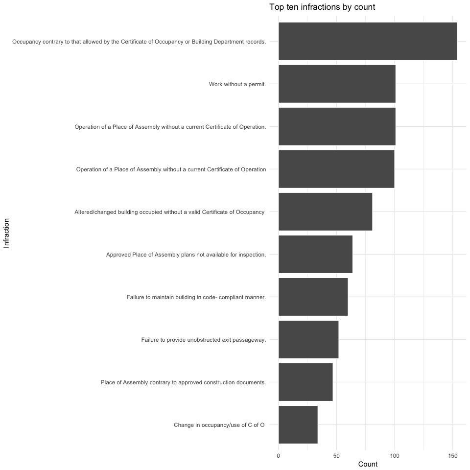

## Setup


```
## Loading required package: ggplot2
```

```
## Loading required package: DBI
```

```
## Loading required package: RPostgres
```


## When Do MARCH raids result in violations?

Raids overwhelmingly happen on weekends (Friday, Saturday, Sunday)


```r
df <- run_query("
WITH uniq_raid AS (
   SELECT DISTINCT
    to_date(inspection_date, 'YYYY-MM-DD') as inspection_date,
    bin_number
   FROM raid
)
SELECT
    upper(to_char(inspection_date, 'day')) as inspection_day_of_week,
    count(1)::int
FROM uniq_raid
GROUP BY 1
ORDER BY 2 DESC;
")
ggplot(df, aes(x=reorder(inspection_day_of_week, count), y=count)) +
  geom_bar(stat='identity') +
  coord_flip() +
  xlab('Day of Week') +
  ylab('Raids') +
  labs(title='MARCH Raids by Day Of Week') +
  theme_minimal()
```

<!-- -->

There's no discernible pattern to raids by month, except for the holidays.


```r
df <- run_query("
WITH uniq_raid AS (
   SELECT DISTINCT
    to_date(inspection_date, 'YYYY-MM-DD') as inspection_date,
    bin_number
   FROM raid
)
SELECT
    to_char(inspection_date, 'MM')::int as inspection_month_num,
    upper(to_char(inspection_date, 'month')) as inspection_month,
    count(1)::int
FROM uniq_raid
GROUP BY 1,2
ORDER BY 1 ASC;
")
ggplot(df, aes(x=reorder(inspection_month, -inspection_month_num), y=count)) +
  geom_bar(stat='identity') +
  coord_flip() +
  xlab('Month') +
  ylab('Raids') +
  labs(title='MARCH Raids by Month') +
  theme_minimal()
```

<!-- -->


```r
df <- run_query("
WITH uniq_raid AS (
   SELECT DISTINCT
    to_date(inspection_date, 'YYYY-MM-DD') as inspection_date,
    bin_number
   FROM raid
)
SELECT
    to_char(inspection_date, 'YYYY')::int as inspection_year,
    count(1)::int
FROM uniq_raid
GROUP BY 1
ORDER BY 1 ASC;
")
ggplot(df, aes(x=inspection_year, y=count)) +
  geom_bar(stat='identity') +
  xlab('Year') +
  ylab('Raids') +
  labs(title='MARCH Raids by Year') +
  theme_minimal()
```

<!-- -->

## What are the outcomes of Raids ?

```r
df <- run_query("
WITH uniq_raid_status AS (
    SELECT DISTINCT
        bin_number,
        inspection_date,
        CASE
        WHEN access_1 IN ('COMPLAINT UNSUBSTANTIATED BASED ON DEPARTMENT RECORDS', 'MARCH: NO ENFORCEMENT ACTION TAKEN', 'NO ACCESS', 'NO VIOLATION WARRANTED FOR COMPLAINT AT TIME OF INSPECTION')
        THEN 'No Action'
        WHEN access_1 IN ('VACATE', 'ADMINISTRATIVE CLOSURE NN') THEN 'Vacate'
        ELSE 'Violation Served'
        END AS status
    FROM raid
    ORDER BY bin_number, inspection_date ASC
)
SELECT
 status,
 count(1)::int
FROM uniq_raid_status
GROUP BY 1
ORDER BY 2 DESC;
")
df$percentage <- 100 * (df$count / sum(df$count))
ggplot(df, aes(x=reorder(status, percentage), y=percentage)) +
  geom_bar(stat='identity', color="white") +
  coord_flip() +
  xlab("Raid outcome") +
  ylab("Percentage of raids") +
  labs(title="Percentage of raids by outcome") +
  theme_minimal()
```

<!-- -->

## How often do MARCH raids result in fines?


```r
df <- run_query("
SELECT
    to_date(inspection_date, 'YYYY-MM-DD') as inspection_date,
    bin_number,
    COUNT(DISTINCT ecb_violation_number)::int
FROM
    raid
GROUP BY
    1,2;
")
ggplot(df, aes(x=count)) +
  geom_histogram(binwidth=1, color="white") +
  xlab("Violations") +
  ylab("Raids") +
  labs(title="Number of Violations per Raid") +
  theme_minimal()
```

<!-- -->

```r
percent <- (sum(ifelse(df$count == 0, 0, 1)) / nrow(df)) * 100
cat(paste0('March RAIDS result in violations ', percent, '% of the time.\n'))
```

```
## March RAIDS result in violations 37.6% of the time.
```

## Do Raids result in Fines on certain days more often?


```r
df <- run_query("
WITH uniq_raid AS (

    SELECT
        to_date(inspection_date, 'YYYY-MM-DD') as inspection_date,
        bin_number,
        COUNT(DISTINCT ecb_violation_number)::int as violation_count
    FROM
        raid
    GROUP BY
        1,2
)

SELECT
    upper(to_char(inspection_date, 'day')) as inspection_day_of_week,
    ROUND(100.0 * (SUM(CASE WHEN violation_count = 0 THEN 0 ELSE 1 END)/ COUNT(1)::float)::numeric, 0) as per_has_violations
FROM uniq_raid
GROUP BY
    1
;")
ggplot(df, aes(x=reorder(inspection_day_of_week, per_has_violations), y=per_has_violations)) +
  geom_bar(stat='identity', position="stack") +
  coord_flip() +
  xlab('Day of Week') +
  ylab('Percent of Raids With Violations') +
  labs(title='Raids with Violations by Day Of Week') +
  theme_minimal()
```

<!-- -->

## What are the outcomes of trials that result from Raids ?


```r
df <- run_query("
with uniq_violations AS (
   SELECT DISTINCT
    to_date(inspection_date, 'YYYY-MM-DD') as inspection_date,
    bin_number,
    ecb_violation_number
   FROM raid
   WHERE ecb_violation_number IS NOT NULL
), violation_stats AS (
SELECT
    og.bin_number,
    og.inspection_date,
    COUNT(1)::int as num_violations_imposed,
    SUM(CASE hearing_status WHEN 'DEFAULT' THEN 1 ELSE 0 END)::int as num_violations_defaulted,
    SUM(CASE hearing_status WHEN 'DISMISSED' THEN 1 ELSE 0 END)::int as num_violations_dismissed,
    SUM(CASE WHEN hearing_status NOT IN ('DEFAULT', 'DISMISSED') THEN 1 ELSE 0 END)::int as num_violations_guilty
FROM
  uniq_violations as og
LEFT JOIN
  ecb ON ecb.violation_number = og.ecb_violation_number
GROUP BY
    1,2
)
SELECT
   CASE
       WHEN num_violations_imposed = num_violations_defaulted
       THEN 'full default'
       WHEN num_violations_imposed = num_violations_dismissed
       THEN 'full dismissal'
       WHEN num_violations_imposed = num_violations_guilty
       THEN 'full guilt'
       WHEN num_violations_dismissed = 0
       THEN 'default + guilt'
       WHEN num_violations_defaulted = 0
       THEN 'dismissal + guilt'
       ELSE 'dismissal + default'
   END as outcome,
   COUNT(1)::int
FROM
  violation_stats
GROUP BY 1
ORDER BY 2 DESC;
")
df$percentage <- round(100.0 * df$count / sum(df$count), 1)
cat('Breakdown of court outcomes for raids:\n')
```

```
## Breakdown of court outcomes for raids:
```

```r
df
```

```
##               outcome count percentage
## 1          full guilt   477       67.7
## 2        full default   105       14.9
## 3      full dismissal    71       10.1
## 4   dismissal + guilt    26        3.7
## 5     default + guilt    24        3.4
## 6 dismissal + default     2        0.3
```

```r
ggplot(df, aes(x=reorder(outcome, count), y=percentage)) +
  geom_bar(stat='identity', color="white") +
  coord_flip() +
  xlab('Court Outcome') +
  ylab('Percentage of Raids') +
  labs(title='Raids by Court Outcomes') +
  theme_minimal()
```

<!-- -->

```r
partial_guilt_per <- round(100.0 * sum(ifelse(grepl('.*guilt.*', df$outcome), df$count, 0)) / sum(df$count), 1)
cat(paste0('Court trials result in some kind of guilt ', partial_guilt_per, '% of the time.\n'))
```

```
## Court trials result in some kind of guilt 74.8% of the time.
```

```r
partial_dismissal_per <- round(100.0 * sum(ifelse(grepl('.*dismissal.*', df$outcome), df$count, 0)) / sum(df$count), 1)
cat(paste0('Court trials resultin some kind of dismissal ', partial_dismissal_per, '% of the time.\n'))
```

```
## Court trials resultin some kind of dismissal 14% of the time.
```

```r
partial_default_per <- round(100.0 * sum(ifelse(grepl('.*default.*', df$outcome), df$count, 0)) / sum(df$count), 1)
cat(paste0('Court trials result in some kind of default ', partial_default_per, '% of the time.\n'))
```

```
## Court trials result in some kind of default 18.6% of the time.
```

## How large are fines associated with Raids ?


```r
df <- run_query("
with uniq_violations AS (
   SELECT DISTINCT
    to_date(inspection_date, 'YYYY-MM-DD') as inspection_date,
    bin_number,
    ecb_violation_number
   FROM raid
   WHERE ecb_violation_number IS NOT NULL
)
SELECT
    og.bin_number,
    og.inspection_date,
    COUNT(1) as num_violations,
    COALESCE(SUM(penalty_imposed), 0) as total_imposed,
    COALESCE(SUM(penalty_amount_paid), 0) AS total_paid
FROM
  uniq_violations as og
LEFT JOIN
  ecb ON ecb.violation_number = og.ecb_violation_number
GROUP BY
    1,2
;")
ggplot(df[df$total_imposed>0,], aes(x=total_imposed)) +
  geom_histogram(binwidth=1000, color="white") +
  labs(title='Distribution of Fines Imposed Per Raid') +
  xlab('Total Fines Imposed in Dollars (Excluding Dismissals)') +
  ylab('Raids') +
  theme_minimal()
```

<!-- -->

```r
cat('Distribution of fines imposed:\n')
```

```
## Distribution of fines imposed:
```

```r
summary(df$total_imposed[df$total_imposed>0])
```

```
##    Min. 1st Qu.  Median    Mean 3rd Qu.    Max. 
##     100     800    1600    2810    3600   40000
```

```r
total_fined <- sum(df$total_imposed)
cat(paste0('In just under 5 years, businesses were fined $', total_fined, ' as a result of MARCH raids.\n'))
```

```
## In just under 5 years, businesses were fined $1593405 as a result of MARCH raids.
```

```r
ggplot(df[df$total_paid>0,], aes(x=total_paid)) +
  geom_histogram(binwidth=1000, color="white") +
  labs(title='Distribution of Fines Paid Per Raid (Excluding Dismissals)') +
  xlab('Total Fines Paid in Dollars') +
  ylab('Raids') +
  theme_minimal()
```

<!-- -->

```r
cat('Distribution of fines paid:\n')
```

```
## Distribution of fines paid:
```

```r
summary(df$total_paid[df$total_paid>0])
```

```
##    Min. 1st Qu.  Median    Mean 3rd Qu.    Max. 
##   100.0   676.3  1200.0  1740.7  2100.1 22503.8
```

```r
total_fined <- sum(df$total_paid)
cat(paste0('In just under 5 years, businesses paid $', total_fined, ' as a result of MARCH raids.\n'))
```

```
## In just under 5 years, businesses paid $771120.82 as a result of MARCH raids.
```

## How often are fines adjusted?


```r
df <- run_query("
with uniq_violations AS (
    SELECT DISTINCT
        to_date(inspection_date, 'YYYY-MM-DD') as inspection_date,
        bin_number,
        ecb_violation_number
    FROM
        raid
    WHERE
        ecb_violation_number IS NOT NULL
), violation_stats AS (
    SELECT
        og.bin_number,
        og.inspection_date,
        SUM(COALESCE(penalty_amount_paid, 0)) as total_paid,
        SUM(COALESCE(penalty_imposed, 0)) as total_imposed
    FROM
        uniq_violations as og
    LEFT JOIN
        ecb ON ecb.violation_number = og.ecb_violation_number
    WHERE
        hearing_status NOT IN ('DEFAULT', 'DISMISSED')
    GROUP BY
        1,2
), adjustment_stats AS (
SELECT
  CASE WHEN total_paid > total_imposed THEN 'adjusted up'
  WHEN total_paid = total_imposed THEN 'no adjustment'
  WHEN total_paid < total_imposed THEN 'adjusted down'
  ELSE 'null'
  END as adjustment,
  COUNT(1)::int
FROM
  violation_stats
GROUP BY 1
ORDER BY 2 DESC
)
SELECT
    *
FROM
  adjustment_stats;
")
df$percentage <- 100 * (df$count / sum(df$count))
ggplot(df, aes(x=reorder(adjustment, percentage), y=percentage)) +
  geom_bar(stat='identity', color='white') +
  coord_flip() + 
  xlab('Type of adjustment') +
  ylab('Percentage of Court cases (only guilty)') +
  labs(title='Percentage of court cases with adjustments (only guilty)') +
  theme_minimal()
```

<!-- -->

## What types of violations are served most often?


```r
df <- run_query("
SELECT
  SPLIT_PART(trim(regexp_replace(code.description, '[[:cntrl:]]', ' ')), 'as per ', 1) as description,
  count(1)::int,
  SUM(penalty_amount_paid) as total_penalty,
  ROUND(AVG(penalty_amount_paid), 0) as avg_penalty,
  MAX(penalty_amount_paid) as max_penalty
FROM
 ecb
LEFT JOIN
  ecb_infraction_codes as code ON
    code.ecb_infraction_code = ecb.infraction_codes
GROUP BY 1
ORDER BY 2 DESC;
")
df$description <- gsub('\\n', ' ', df$description)

ggplot(head(df, 10), aes(x=reorder(description, count), y=count)) +
  geom_bar(stat='identity', color='white') +
  coord_flip() +
  xlab('Infraction') +
  ylab('Count') +
  labs(title='Top ten infractions by count') +
  theme_minimal()
```

<!-- -->

```r
ggplot(head(df, 10), aes(x=reorder(description, avg_penalty), y=avg_penalty)) +
  geom_bar(stat='identity', color='white') +
  coord_flip() +
  xlab('Infraction') +
  ylab('Avg Fine (Dollars)') +
  labs(title='Top ten infractions by avg fine') +
  theme_minimal()
```

<!-- -->

```r
ggplot(head(df, 10), aes(x=reorder(description, total_penalty), y=total_penalty)) +
  geom_bar(stat='identity', color='white') +
  coord_flip() +
  xlab('Infraction') +
  ylab('Total Fine (Dollars)') +
  labs(title='Top ten infractions by total fine') +
  theme_minimal()
```

<!-- -->

```r
ggplot(head(df, 10), aes(x=reorder(description, max_penalty), y=max_penalty)) +
  geom_bar(stat='identity', color='white') +
  coord_flip() +
  xlab('Infraction') +
  ylab('Max Fine (Dollars)') +
  labs(title='Top ten infractions by max fine') +
  theme_minimal()
```

<!-- -->


